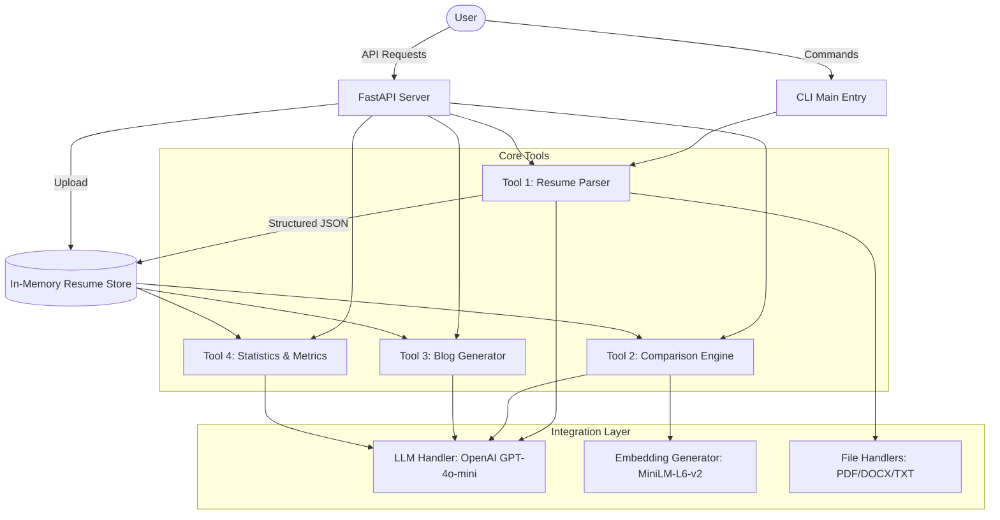

# Resume Analysis & Comparison System

A powerful, AI-driven platform to parse, compare, and analyze technical resumes. This system leverages OpenAI's GPT models and Sentence Transformers to provide deep insights, technical rankings, and automated blog generation.

## 🏗️ Architecture Flow (Mermaid.js)



## 📂 File Documentation

### **Root Directory**
| File | Description |
| :--- | :--- |
| `main.py` | Main entry point for CLI usage. Coordinates tools for parsing and comparison. |
| `src/server.py` | FastAPI application defining the REST API endpoints. |
| `requirements.txt` | List of Python dependencies (FastAPI, OpenAI, etc.). |
| `.env` | Environment variables (contains `OPENAI_API_KEY`). |
| `config/config.yaml` | Central configuration for LLM models and embedding settings. |
| `run_quick_test.py` | A diagnostic script to verify the entire pipeline works correctly. |

### **Source Code (`src/`)**
| Component | Folder/File | Description |
| :--- | :--- | :--- |
| **Tools** | `src/tools/tool1_resume_parser.py` | Extracts text and structure from resumes using the LLM. |
| | `src/tools/tool2_comparison_engine.py` | Computes similarity scores and generates comparative analysis. |
| | `src/tools/tool3_blog_generator.py` | Generates professional markdown blog posts comparing candidates. |
| | `src/tools/tool4_stats...` | (Included in engine/server) Generates performance scores (1-10). |
| **Integration**| `src/llm_integration/llm_handler.py` | Manages communication with OpenAI API. |
| | `src/embeddings/embedding_generator.py`| Generates vector embeddings for semantic similarity. |
| **Utils** | `src/utils/file_handlers.py` | Handles reading of PDF, DOCX, and TXT files. |

## 🚀 How the Project Works

### 1. Data Ingestion
The user uploads files (PDF/DOCX/TXT) via the CLI or API. The **FileHandlers** extract the raw text, while the **ResumeParser** uses OpenAI to convert messy text into structured JSON (Skills, Experience, Tech Stack).

### 2. Semantic Analysis
The **EmbeddingGenerator** converts resume sections into 384-dimensional numeric vectors. The **ComparisonEngine** then uses **Cosine Similarity** to mathematically determine how closely two candidates match each other technically.

### 3. Tool-Based Insights
- **Tool 1 (QA)**: Allows the user to ask natural language questions (e.g., "Does he know Docker?") which are answered precisely by looking at the parsed resume data.
- **Tool 2 (Comparison)**: Ranks candidates based on shared and unique technical skills.
- **Tool 3 (Blog)**: Turns the data into a readable technical hiring report.
- **Tool 4 (Stats)**: Scores candidates from 1-10 on Technical Depth, Experience, Education, and Diversity.

## 🛠️ Usage

### API Server (Recommended)
```bash
python -m src.server
```
Access the interactive docs at `http://localhost:8000/docs`.

### CLI Interface
```bash
python main.py --resumes path/to/res1.pdf path/to/res2.pdf --questions "What is their tech stack?"
```